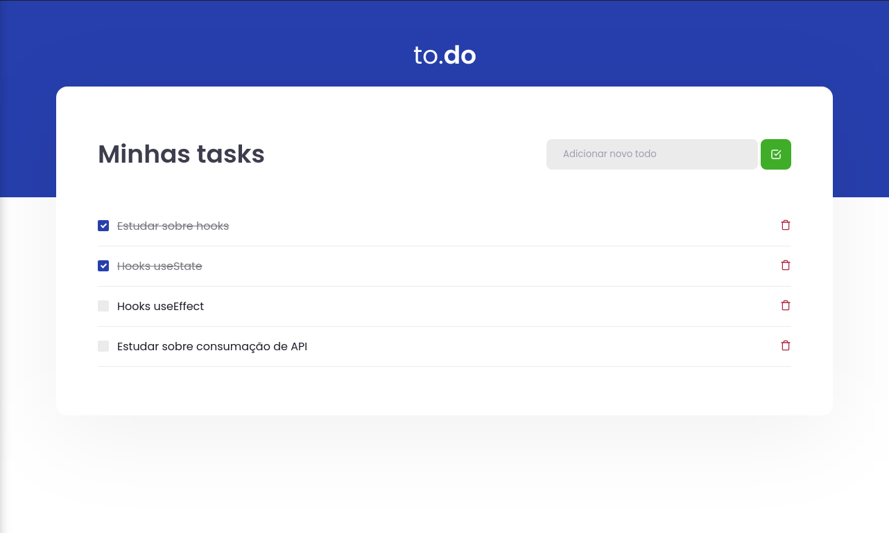

# ❓ Ignite - Desafio to-do

A challenge proposed at Ignite (a Rockeatseat course - https://app.rocketseat.com.br/). aims to build a functional schedule for scheduling your day-to-day tasks

## ⚠️ Requirements

You must have installed the npm package - Node + NPM, Yarn

## 📱 Current state

This current app is like the images below:

    <code>
        
    </code>

